```python
import numpy as np
import matplotlib.pyplot as plt
import pandas as pd
import seaborn as sns


```


```python
df=pd.read_csv('C:\\Users\\bhavya\\Documents\\codanics\\challenge-1\\temperature_change_data.csv')
df.head()
```


<div>
<style scoped>
    .dataframe tbody tr th:only-of-type {
        vertical-align: middle;
    }

    .dataframe tbody tr th {
        vertical-align: top;
    }

    .dataframe thead th {
        text-align: right;
    }
</style>
<table border="1" class="dataframe">
  <thead>
    <tr style="text-align: right;">
      <th></th>
      <th>Domain Code</th>
      <th>Domain</th>
      <th>Area Code (ISO3)</th>
      <th>Area</th>
      <th>Element Code</th>
      <th>Element</th>
      <th>Months Code</th>
      <th>Months</th>
      <th>Year Code</th>
      <th>Year</th>
      <th>Unit</th>
      <th>Value</th>
      <th>Flag</th>
      <th>Flag Description</th>
    </tr>
  </thead>
  <tbody>
    <tr>
      <th>0</th>
      <td>ET</td>
      <td>Temperature change</td>
      <td>AFG</td>
      <td>Afghanistan</td>
      <td>7271</td>
      <td>Temperature change</td>
      <td>7016</td>
      <td>Dec–Jan–Feb</td>
      <td>1961</td>
      <td>1961</td>
      <td>°C</td>
      <td>-0.751</td>
      <td>Fc</td>
      <td>Calculated data</td>
    </tr>
    <tr>
      <th>1</th>
      <td>ET</td>
      <td>Temperature change</td>
      <td>AFG</td>
      <td>Afghanistan</td>
      <td>7271</td>
      <td>Temperature change</td>
      <td>7016</td>
      <td>Dec–Jan–Feb</td>
      <td>1962</td>
      <td>1962</td>
      <td>°C</td>
      <td>0.985</td>
      <td>Fc</td>
      <td>Calculated data</td>
    </tr>
    <tr>
      <th>2</th>
      <td>ET</td>
      <td>Temperature change</td>
      <td>AFG</td>
      <td>Afghanistan</td>
      <td>7271</td>
      <td>Temperature change</td>
      <td>7016</td>
      <td>Dec–Jan–Feb</td>
      <td>1963</td>
      <td>1963</td>
      <td>°C</td>
      <td>1.931</td>
      <td>Fc</td>
      <td>Calculated data</td>
    </tr>
    <tr>
      <th>3</th>
      <td>ET</td>
      <td>Temperature change</td>
      <td>AFG</td>
      <td>Afghanistan</td>
      <td>7271</td>
      <td>Temperature change</td>
      <td>7016</td>
      <td>Dec–Jan–Feb</td>
      <td>1964</td>
      <td>1964</td>
      <td>°C</td>
      <td>-2.056</td>
      <td>Fc</td>
      <td>Calculated data</td>
    </tr>
    <tr>
      <th>4</th>
      <td>ET</td>
      <td>Temperature change</td>
      <td>AFG</td>
      <td>Afghanistan</td>
      <td>7271</td>
      <td>Temperature change</td>
      <td>7016</td>
      <td>Dec–Jan–Feb</td>
      <td>1965</td>
      <td>1965</td>
      <td>°C</td>
      <td>-0.669</td>
      <td>Fc</td>
      <td>Calculated data</td>
    </tr>
  </tbody>
</table>
</div>


```python
df.info()
```

    <class 'pandas.core.frame.DataFrame'>
    RangeIndex: 67625 entries, 0 to 67624
    Data columns (total 14 columns):
     #   Column            Non-Null Count  Dtype  
    ---  ------            --------------  -----  
     0   Domain Code       67625 non-null  object 
     1   Domain            67625 non-null  object 
     2   Area Code (ISO3)  67625 non-null  object 
     3   Area              67625 non-null  object 
     4   Element Code      67625 non-null  int64  
     5   Element           67625 non-null  object 
     6   Months Code       67625 non-null  int64  
     7   Months            67625 non-null  object 
     8   Year Code         67625 non-null  int64  
     9   Year              67625 non-null  int64  
     10  Unit              67625 non-null  object 
     11  Value             65331 non-null  float64
     12  Flag              67625 non-null  object 
     13  Flag Description  67625 non-null  object 
    dtypes: float64(1), int64(4), object(9)
    memory usage: 7.2+ MB
    


```python
df.describe()
```


<div>
<style scoped>
    .dataframe tbody tr th:only-of-type {
        vertical-align: middle;
    }

    .dataframe tbody tr th {
        vertical-align: top;
    }

    .dataframe thead th {
        text-align: right;
    }
</style>
<table border="1" class="dataframe">
  <thead>
    <tr style="text-align: right;">
      <th></th>
      <th>Element Code</th>
      <th>Months Code</th>
      <th>Year Code</th>
      <th>Year</th>
      <th>Value</th>
    </tr>
  </thead>
  <tbody>
    <tr>
      <th>count</th>
      <td>67625.0</td>
      <td>67625.000000</td>
      <td>67625.000000</td>
      <td>67625.000000</td>
      <td>65331.000000</td>
    </tr>
    <tr>
      <th>mean</th>
      <td>7271.0</td>
      <td>7018.000000</td>
      <td>1991.306248</td>
      <td>1991.306248</td>
      <td>0.491524</td>
    </tr>
    <tr>
      <th>std</th>
      <td>0.0</td>
      <td>1.414224</td>
      <td>17.333343</td>
      <td>17.333343</td>
      <td>0.820116</td>
    </tr>
    <tr>
      <th>min</th>
      <td>7271.0</td>
      <td>7016.000000</td>
      <td>1961.000000</td>
      <td>1961.000000</td>
      <td>-5.979000</td>
    </tr>
    <tr>
      <th>25%</th>
      <td>7271.0</td>
      <td>7017.000000</td>
      <td>1976.000000</td>
      <td>1976.000000</td>
      <td>-0.011000</td>
    </tr>
    <tr>
      <th>50%</th>
      <td>7271.0</td>
      <td>7018.000000</td>
      <td>1992.000000</td>
      <td>1992.000000</td>
      <td>0.410000</td>
    </tr>
    <tr>
      <th>75%</th>
      <td>7271.0</td>
      <td>7019.000000</td>
      <td>2006.000000</td>
      <td>2006.000000</td>
      <td>0.932000</td>
    </tr>
    <tr>
      <th>max</th>
      <td>7271.0</td>
      <td>7020.000000</td>
      <td>2020.000000</td>
      <td>2020.000000</td>
      <td>8.206000</td>
    </tr>
  </tbody>
</table>
</div>


```python
df.shape
```


    (67625, 14)


```python
df.isna().sum()
```


    Domain Code            0
    Domain                 0
    Area Code (ISO3)       0
    Area                   0
    Element Code           0
    Element                0
    Months Code            0
    Months                 0
    Year Code              0
    Year                   0
    Unit                   0
    Value               2294
    Flag                   0
    Flag Description       0
    dtype: int64


```python
df.isna().sum()/df.shape[0] *100
```


    Domain Code         0.000000
    Domain              0.000000
    Area Code (ISO3)    0.000000
    Area                0.000000
    Element Code        0.000000
    Element             0.000000
    Months Code         0.000000
    Months              0.000000
    Year Code           0.000000
    Year                0.000000
    Unit                0.000000
    Value               3.392237
    Flag                0.000000
    Flag Description    0.000000
    dtype: float64


```python
df.dropna(inplace=True)
```


```python
df.isna().sum()
```


    Domain Code         0
    Domain              0
    Area Code (ISO3)    0
    Area                0
    Element Code        0
    Element             0
    Months Code         0
    Months              0
    Year Code           0
    Year                0
    Unit                0
    Value               0
    Flag                0
    Flag Description    0
    dtype: int64


```python
df.head()
```


<div>
<style scoped>
    .dataframe tbody tr th:only-of-type {
        vertical-align: middle;
    }

    .dataframe tbody tr th {
        vertical-align: top;
    }

    .dataframe thead th {
        text-align: right;
    }
</style>
<table border="1" class="dataframe">
  <thead>
    <tr style="text-align: right;">
      <th></th>
      <th>Domain Code</th>
      <th>Domain</th>
      <th>Area Code (ISO3)</th>
      <th>Area</th>
      <th>Element Code</th>
      <th>Element</th>
      <th>Months Code</th>
      <th>Months</th>
      <th>Year Code</th>
      <th>Year</th>
      <th>Unit</th>
      <th>Value</th>
      <th>Flag</th>
      <th>Flag Description</th>
    </tr>
  </thead>
  <tbody>
    <tr>
      <th>0</th>
      <td>ET</td>
      <td>Temperature change</td>
      <td>AFG</td>
      <td>Afghanistan</td>
      <td>7271</td>
      <td>Temperature change</td>
      <td>7016</td>
      <td>Dec–Jan–Feb</td>
      <td>1961</td>
      <td>1961</td>
      <td>°C</td>
      <td>-0.751</td>
      <td>Fc</td>
      <td>Calculated data</td>
    </tr>
    <tr>
      <th>1</th>
      <td>ET</td>
      <td>Temperature change</td>
      <td>AFG</td>
      <td>Afghanistan</td>
      <td>7271</td>
      <td>Temperature change</td>
      <td>7016</td>
      <td>Dec–Jan–Feb</td>
      <td>1962</td>
      <td>1962</td>
      <td>°C</td>
      <td>0.985</td>
      <td>Fc</td>
      <td>Calculated data</td>
    </tr>
    <tr>
      <th>2</th>
      <td>ET</td>
      <td>Temperature change</td>
      <td>AFG</td>
      <td>Afghanistan</td>
      <td>7271</td>
      <td>Temperature change</td>
      <td>7016</td>
      <td>Dec–Jan–Feb</td>
      <td>1963</td>
      <td>1963</td>
      <td>°C</td>
      <td>1.931</td>
      <td>Fc</td>
      <td>Calculated data</td>
    </tr>
    <tr>
      <th>3</th>
      <td>ET</td>
      <td>Temperature change</td>
      <td>AFG</td>
      <td>Afghanistan</td>
      <td>7271</td>
      <td>Temperature change</td>
      <td>7016</td>
      <td>Dec–Jan–Feb</td>
      <td>1964</td>
      <td>1964</td>
      <td>°C</td>
      <td>-2.056</td>
      <td>Fc</td>
      <td>Calculated data</td>
    </tr>
    <tr>
      <th>4</th>
      <td>ET</td>
      <td>Temperature change</td>
      <td>AFG</td>
      <td>Afghanistan</td>
      <td>7271</td>
      <td>Temperature change</td>
      <td>7016</td>
      <td>Dec–Jan–Feb</td>
      <td>1965</td>
      <td>1965</td>
      <td>°C</td>
      <td>-0.669</td>
      <td>Fc</td>
      <td>Calculated data</td>
    </tr>
  </tbody>
</table>
</div>


```python
df[['Area','Value','Year']]
```


<div>
<style scoped>
    .dataframe tbody tr th:only-of-type {
        vertical-align: middle;
    }

    .dataframe tbody tr th {
        vertical-align: top;
    }

    .dataframe thead th {
        text-align: right;
    }
</style>
<table border="1" class="dataframe">
  <thead>
    <tr style="text-align: right;">
      <th></th>
      <th>Area</th>
      <th>Value</th>
      <th>Year</th>
    </tr>
  </thead>
  <tbody>
    <tr>
      <th>0</th>
      <td>Afghanistan</td>
      <td>-0.751</td>
      <td>1961</td>
    </tr>
    <tr>
      <th>1</th>
      <td>Afghanistan</td>
      <td>0.985</td>
      <td>1962</td>
    </tr>
    <tr>
      <th>2</th>
      <td>Afghanistan</td>
      <td>1.931</td>
      <td>1963</td>
    </tr>
    <tr>
      <th>3</th>
      <td>Afghanistan</td>
      <td>-2.056</td>
      <td>1964</td>
    </tr>
    <tr>
      <th>4</th>
      <td>Afghanistan</td>
      <td>-0.669</td>
      <td>1965</td>
    </tr>
    <tr>
      <th>...</th>
      <td>...</td>
      <td>...</td>
      <td>...</td>
    </tr>
    <tr>
      <th>67620</th>
      <td>Zimbabwe</td>
      <td>1.470</td>
      <td>2016</td>
    </tr>
    <tr>
      <th>67621</th>
      <td>Zimbabwe</td>
      <td>0.443</td>
      <td>2017</td>
    </tr>
    <tr>
      <th>67622</th>
      <td>Zimbabwe</td>
      <td>0.747</td>
      <td>2018</td>
    </tr>
    <tr>
      <th>67623</th>
      <td>Zimbabwe</td>
      <td>1.359</td>
      <td>2019</td>
    </tr>
    <tr>
      <th>67624</th>
      <td>Zimbabwe</td>
      <td>0.820</td>
      <td>2020</td>
    </tr>
  </tbody>
</table>
<p>65331 rows × 3 columns</p>
</div>


```python
df['Area'].value_counts()
```


    Afghanistan              300
    Myanmar                  300
    Mali                     300
    Malta                    300
    Mauritania               300
                            ... 
    Montenegro                75
    Serbia                    75
    Serbia and Montenegro     70
    South Sudan               50
    Sudan                     50
    Name: Area, Length: 247, dtype: int64


```python
df_selected = df[df["Area"].isin(["India", "Pakistan", "Bangladesh"])]


```


```python
df_selected.head()
```


<div>
<style scoped>
    .dataframe tbody tr th:only-of-type {
        vertical-align: middle;
    }

    .dataframe tbody tr th {
        vertical-align: top;
    }

    .dataframe thead th {
        text-align: right;
    }
</style>
<table border="1" class="dataframe">
  <thead>
    <tr style="text-align: right;">
      <th></th>
      <th>Domain Code</th>
      <th>Domain</th>
      <th>Area Code (ISO3)</th>
      <th>Area</th>
      <th>Element Code</th>
      <th>Element</th>
      <th>Months Code</th>
      <th>Months</th>
      <th>Year Code</th>
      <th>Year</th>
      <th>Unit</th>
      <th>Value</th>
      <th>Flag</th>
      <th>Flag Description</th>
    </tr>
  </thead>
  <tbody>
    <tr>
      <th>4790</th>
      <td>ET</td>
      <td>Temperature change</td>
      <td>BGD</td>
      <td>Bangladesh</td>
      <td>7271</td>
      <td>Temperature change</td>
      <td>7016</td>
      <td>Dec–Jan–Feb</td>
      <td>1961</td>
      <td>1961</td>
      <td>°C</td>
      <td>-0.041</td>
      <td>Fc</td>
      <td>Calculated data</td>
    </tr>
    <tr>
      <th>4791</th>
      <td>ET</td>
      <td>Temperature change</td>
      <td>BGD</td>
      <td>Bangladesh</td>
      <td>7271</td>
      <td>Temperature change</td>
      <td>7016</td>
      <td>Dec–Jan–Feb</td>
      <td>1962</td>
      <td>1962</td>
      <td>°C</td>
      <td>-1.002</td>
      <td>Fc</td>
      <td>Calculated data</td>
    </tr>
    <tr>
      <th>4792</th>
      <td>ET</td>
      <td>Temperature change</td>
      <td>BGD</td>
      <td>Bangladesh</td>
      <td>7271</td>
      <td>Temperature change</td>
      <td>7016</td>
      <td>Dec–Jan–Feb</td>
      <td>1963</td>
      <td>1963</td>
      <td>°C</td>
      <td>0.261</td>
      <td>Fc</td>
      <td>Calculated data</td>
    </tr>
    <tr>
      <th>4793</th>
      <td>ET</td>
      <td>Temperature change</td>
      <td>BGD</td>
      <td>Bangladesh</td>
      <td>7271</td>
      <td>Temperature change</td>
      <td>7016</td>
      <td>Dec–Jan–Feb</td>
      <td>1964</td>
      <td>1964</td>
      <td>°C</td>
      <td>0.113</td>
      <td>Fc</td>
      <td>Calculated data</td>
    </tr>
    <tr>
      <th>4794</th>
      <td>ET</td>
      <td>Temperature change</td>
      <td>BGD</td>
      <td>Bangladesh</td>
      <td>7271</td>
      <td>Temperature change</td>
      <td>7016</td>
      <td>Dec–Jan–Feb</td>
      <td>1965</td>
      <td>1965</td>
      <td>°C</td>
      <td>0.101</td>
      <td>Fc</td>
      <td>Calculated data</td>
    </tr>
  </tbody>
</table>
</div>


```python
df_selected.groupby(by="Area").mean()

```


<div>
<style scoped>
    .dataframe tbody tr th:only-of-type {
        vertical-align: middle;
    }

    .dataframe tbody tr th {
        vertical-align: top;
    }

    .dataframe thead th {
        text-align: right;
    }
</style>
<table border="1" class="dataframe">
  <thead>
    <tr style="text-align: right;">
      <th></th>
      <th>Element Code</th>
      <th>Months Code</th>
      <th>Year Code</th>
      <th>Year</th>
      <th>Value</th>
    </tr>
    <tr>
      <th>Area</th>
      <th></th>
      <th></th>
      <th></th>
      <th></th>
      <th></th>
    </tr>
  </thead>
  <tbody>
    <tr>
      <th>Bangladesh</th>
      <td>7271.0</td>
      <td>7018.0</td>
      <td>1990.5</td>
      <td>1990.5</td>
      <td>0.279613</td>
    </tr>
    <tr>
      <th>India</th>
      <td>7271.0</td>
      <td>7018.0</td>
      <td>1990.5</td>
      <td>1990.5</td>
      <td>0.274867</td>
    </tr>
    <tr>
      <th>Pakistan</th>
      <td>7271.0</td>
      <td>7018.0</td>
      <td>1990.5</td>
      <td>1990.5</td>
      <td>0.271827</td>
    </tr>
  </tbody>
</table>
</div>


```python
df_selected.groupby(by="Area").agg(["min", "max", "mean"])

```


<div>
<style scoped>
    .dataframe tbody tr th:only-of-type {
        vertical-align: middle;
    }

    .dataframe tbody tr th {
        vertical-align: top;
    }

    .dataframe thead tr th {
        text-align: left;
    }

    .dataframe thead tr:last-of-type th {
        text-align: right;
    }
</style>
<table border="1" class="dataframe">
  <thead>
    <tr>
      <th></th>
      <th colspan="3" halign="left">Element Code</th>
      <th colspan="3" halign="left">Months Code</th>
      <th colspan="3" halign="left">Year Code</th>
      <th colspan="3" halign="left">Year</th>
      <th colspan="3" halign="left">Value</th>
    </tr>
    <tr>
      <th></th>
      <th>min</th>
      <th>max</th>
      <th>mean</th>
      <th>min</th>
      <th>max</th>
      <th>mean</th>
      <th>min</th>
      <th>max</th>
      <th>mean</th>
      <th>min</th>
      <th>max</th>
      <th>mean</th>
      <th>min</th>
      <th>max</th>
      <th>mean</th>
    </tr>
    <tr>
      <th>Area</th>
      <th></th>
      <th></th>
      <th></th>
      <th></th>
      <th></th>
      <th></th>
      <th></th>
      <th></th>
      <th></th>
      <th></th>
      <th></th>
      <th></th>
      <th></th>
      <th></th>
      <th></th>
    </tr>
  </thead>
  <tbody>
    <tr>
      <th>Bangladesh</th>
      <td>7271</td>
      <td>7271</td>
      <td>7271.0</td>
      <td>7016</td>
      <td>7020</td>
      <td>7018.0</td>
      <td>1961</td>
      <td>2020</td>
      <td>1990.5</td>
      <td>1961</td>
      <td>2020</td>
      <td>1990.5</td>
      <td>-1.352</td>
      <td>1.981</td>
      <td>0.279613</td>
    </tr>
    <tr>
      <th>India</th>
      <td>7271</td>
      <td>7271</td>
      <td>7271.0</td>
      <td>7016</td>
      <td>7020</td>
      <td>7018.0</td>
      <td>1961</td>
      <td>2020</td>
      <td>1990.5</td>
      <td>1961</td>
      <td>2020</td>
      <td>1990.5</td>
      <td>-1.116</td>
      <td>1.824</td>
      <td>0.274867</td>
    </tr>
    <tr>
      <th>Pakistan</th>
      <td>7271</td>
      <td>7271</td>
      <td>7271.0</td>
      <td>7016</td>
      <td>7020</td>
      <td>7018.0</td>
      <td>1961</td>
      <td>2020</td>
      <td>1990.5</td>
      <td>1961</td>
      <td>2020</td>
      <td>1990.5</td>
      <td>-1.626</td>
      <td>3.129</td>
      <td>0.271827</td>
    </tr>
  </tbody>
</table>
</div>


```python

IN_avg_temps = df_selected[df_selected["Area"]=="India"]["Value"]
PK_avg_temps = df_selected[df_selected["Area"]=="Pakistan"]["Value"]
BD_avg_temps = df_selected[df_selected["Area"]=="Bangladesh"]["Value"]
```


```python

sns.distplot(IN_avg_temps)
sns.distplot(PK_avg_temps)
sns.distplot(BD_avg_temps)
```

    c:\Users\bhavya\anaconda39\lib\site-packages\seaborn\distributions.py:2619: FutureWarning: `distplot` is a deprecated function and will be removed in a future version. Please adapt your code to use either `displot` (a figure-level function with similar flexibility) or `histplot` (an axes-level function for histograms).
      warnings.warn(msg, FutureWarning)
    c:\Users\bhavya\anaconda39\lib\site-packages\seaborn\distributions.py:2619: FutureWarning: `distplot` is a deprecated function and will be removed in a future version. Please adapt your code to use either `displot` (a figure-level function with similar flexibility) or `histplot` (an axes-level function for histograms).
      warnings.warn(msg, FutureWarning)
    c:\Users\bhavya\anaconda39\lib\site-packages\seaborn\distributions.py:2619: FutureWarning: `distplot` is a deprecated function and will be removed in a future version. Please adapt your code to use either `displot` (a figure-level function with similar flexibility) or `histplot` (an axes-level function for histograms).
      warnings.warn(msg, FutureWarning)
    


    <AxesSubplot:xlabel='Value', ylabel='Density'>


    
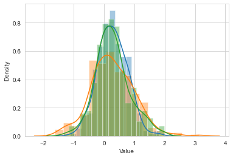
    


```python
df_selected["Area"].value_counts().index

```


    Index(['Bangladesh', 'India', 'Pakistan'], dtype='object')


```python
countries=df_selected['Area'].unique()
```


```python
for country in countries:
    sns.distplot(df_selected[df_selected["Area"]==country]["Value"])
```

    c:\Users\bhavya\anaconda39\lib\site-packages\seaborn\distributions.py:2619: FutureWarning: `distplot` is a deprecated function and will be removed in a future version. Please adapt your code to use either `displot` (a figure-level function with similar flexibility) or `histplot` (an axes-level function for histograms).
      warnings.warn(msg, FutureWarning)
    c:\Users\bhavya\anaconda39\lib\site-packages\seaborn\distributions.py:2619: FutureWarning: `distplot` is a deprecated function and will be removed in a future version. Please adapt your code to use either `displot` (a figure-level function with similar flexibility) or `histplot` (an axes-level function for histograms).
      warnings.warn(msg, FutureWarning)
    c:\Users\bhavya\anaconda39\lib\site-packages\seaborn\distributions.py:2619: FutureWarning: `distplot` is a deprecated function and will be removed in a future version. Please adapt your code to use either `displot` (a figure-level function with similar flexibility) or `histplot` (an axes-level function for histograms).
      warnings.warn(msg, FutureWarning)
    


    
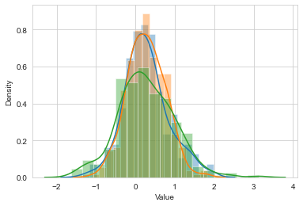
    


```python
sns.set_style("whitegrid")
plt.figure(figsize=(15,5))

for country in countries:
    sns.distplot(df_selected[df_selected["Area"]==country]["Value"])
    
plt.legend(countries)
```

    c:\Users\bhavya\anaconda39\lib\site-packages\seaborn\distributions.py:2619: FutureWarning: `distplot` is a deprecated function and will be removed in a future version. Please adapt your code to use either `displot` (a figure-level function with similar flexibility) or `histplot` (an axes-level function for histograms).
      warnings.warn(msg, FutureWarning)
    c:\Users\bhavya\anaconda39\lib\site-packages\seaborn\distributions.py:2619: FutureWarning: `distplot` is a deprecated function and will be removed in a future version. Please adapt your code to use either `displot` (a figure-level function with similar flexibility) or `histplot` (an axes-level function for histograms).
      warnings.warn(msg, FutureWarning)
    c:\Users\bhavya\anaconda39\lib\site-packages\seaborn\distributions.py:2619: FutureWarning: `distplot` is a deprecated function and will be removed in a future version. Please adapt your code to use either `displot` (a figure-level function with similar flexibility) or `histplot` (an axes-level function for histograms).
      warnings.warn(msg, FutureWarning)
    


    <matplotlib.legend.Legend at 0xf814c397f0>


    
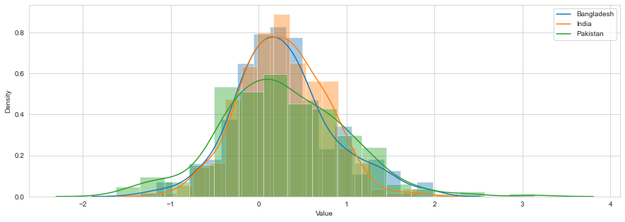
    


```python
sns.set_style("whitegrid")
plt.figure(figsize=(15,5))
color= ["green","blue","orange"]

for color,ulke in zip(color,countries):
    sns.distplot(df_selected[df_selected["Area"]==country]["Value"])
    countries_mean = df_selected[df_selected["Area"]==country]["Value"].mean()
    plt.vlines(countries_mean, 0, 0.16, color=color)

plt.legend(countries)
```

    c:\Users\bhavya\anaconda39\lib\site-packages\seaborn\distributions.py:2619: FutureWarning: `distplot` is a deprecated function and will be removed in a future version. Please adapt your code to use either `displot` (a figure-level function with similar flexibility) or `histplot` (an axes-level function for histograms).
      warnings.warn(msg, FutureWarning)
    c:\Users\bhavya\anaconda39\lib\site-packages\seaborn\distributions.py:2619: FutureWarning: `distplot` is a deprecated function and will be removed in a future version. Please adapt your code to use either `displot` (a figure-level function with similar flexibility) or `histplot` (an axes-level function for histograms).
      warnings.warn(msg, FutureWarning)
    c:\Users\bhavya\anaconda39\lib\site-packages\seaborn\distributions.py:2619: FutureWarning: `distplot` is a deprecated function and will be removed in a future version. Please adapt your code to use either `displot` (a figure-level function with similar flexibility) or `histplot` (an axes-level function for histograms).
      warnings.warn(msg, FutureWarning)
    


    <matplotlib.legend.Legend at 0xf814e652e0>


    
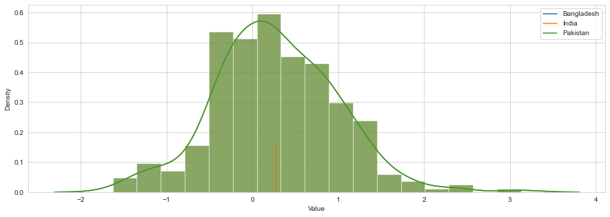
    


```python
df_selected.head()

```


<div>
<style scoped>
    .dataframe tbody tr th:only-of-type {
        vertical-align: middle;
    }

    .dataframe tbody tr th {
        vertical-align: top;
    }

    .dataframe thead th {
        text-align: right;
    }
</style>
<table border="1" class="dataframe">
  <thead>
    <tr style="text-align: right;">
      <th></th>
      <th>Domain Code</th>
      <th>Domain</th>
      <th>Area Code (ISO3)</th>
      <th>Area</th>
      <th>Element Code</th>
      <th>Element</th>
      <th>Months Code</th>
      <th>Months</th>
      <th>Year Code</th>
      <th>Year</th>
      <th>Unit</th>
      <th>Value</th>
      <th>Flag</th>
      <th>Flag Description</th>
    </tr>
  </thead>
  <tbody>
    <tr>
      <th>4790</th>
      <td>ET</td>
      <td>Temperature change</td>
      <td>BGD</td>
      <td>Bangladesh</td>
      <td>7271</td>
      <td>Temperature change</td>
      <td>7016</td>
      <td>Dec–Jan–Feb</td>
      <td>1961</td>
      <td>1961</td>
      <td>°C</td>
      <td>-0.041</td>
      <td>Fc</td>
      <td>Calculated data</td>
    </tr>
    <tr>
      <th>4791</th>
      <td>ET</td>
      <td>Temperature change</td>
      <td>BGD</td>
      <td>Bangladesh</td>
      <td>7271</td>
      <td>Temperature change</td>
      <td>7016</td>
      <td>Dec–Jan–Feb</td>
      <td>1962</td>
      <td>1962</td>
      <td>°C</td>
      <td>-1.002</td>
      <td>Fc</td>
      <td>Calculated data</td>
    </tr>
    <tr>
      <th>4792</th>
      <td>ET</td>
      <td>Temperature change</td>
      <td>BGD</td>
      <td>Bangladesh</td>
      <td>7271</td>
      <td>Temperature change</td>
      <td>7016</td>
      <td>Dec–Jan–Feb</td>
      <td>1963</td>
      <td>1963</td>
      <td>°C</td>
      <td>0.261</td>
      <td>Fc</td>
      <td>Calculated data</td>
    </tr>
    <tr>
      <th>4793</th>
      <td>ET</td>
      <td>Temperature change</td>
      <td>BGD</td>
      <td>Bangladesh</td>
      <td>7271</td>
      <td>Temperature change</td>
      <td>7016</td>
      <td>Dec–Jan–Feb</td>
      <td>1964</td>
      <td>1964</td>
      <td>°C</td>
      <td>0.113</td>
      <td>Fc</td>
      <td>Calculated data</td>
    </tr>
    <tr>
      <th>4794</th>
      <td>ET</td>
      <td>Temperature change</td>
      <td>BGD</td>
      <td>Bangladesh</td>
      <td>7271</td>
      <td>Temperature change</td>
      <td>7016</td>
      <td>Dec–Jan–Feb</td>
      <td>1965</td>
      <td>1965</td>
      <td>°C</td>
      <td>0.101</td>
      <td>Fc</td>
      <td>Calculated data</td>
    </tr>
  </tbody>
</table>
</div>


```python
df = df[df["Months"]=="Meteorological year"]
x = ["Area Code (ISO3)", "Domain Code","Domain","Element Code","Months Code","Year Code", "Months", "Flag Description", "Flag"]
df.rename(columns = {"Area": "Country"}, inplace = True)
```


```python
#Transforming the dataset for use later in the project
df_group = df.groupby(["Country", "Year"])["Value"].mean().reset_index()
df.head()
```


<div>
<style scoped>
    .dataframe tbody tr th:only-of-type {
        vertical-align: middle;
    }

    .dataframe tbody tr th {
        vertical-align: top;
    }

    .dataframe thead th {
        text-align: right;
    }
</style>
<table border="1" class="dataframe">
  <thead>
    <tr style="text-align: right;">
      <th></th>
      <th>Domain Code</th>
      <th>Domain</th>
      <th>Area Code (ISO3)</th>
      <th>Country</th>
      <th>Element Code</th>
      <th>Element</th>
      <th>Months Code</th>
      <th>Months</th>
      <th>Year Code</th>
      <th>Year</th>
      <th>Unit</th>
      <th>Value</th>
      <th>Flag</th>
      <th>Flag Description</th>
    </tr>
  </thead>
  <tbody>
    <tr>
      <th>240</th>
      <td>ET</td>
      <td>Temperature change</td>
      <td>AFG</td>
      <td>Afghanistan</td>
      <td>7271</td>
      <td>Temperature change</td>
      <td>7020</td>
      <td>Meteorological year</td>
      <td>1961</td>
      <td>1961</td>
      <td>°C</td>
      <td>-0.121</td>
      <td>Fc</td>
      <td>Calculated data</td>
    </tr>
    <tr>
      <th>241</th>
      <td>ET</td>
      <td>Temperature change</td>
      <td>AFG</td>
      <td>Afghanistan</td>
      <td>7271</td>
      <td>Temperature change</td>
      <td>7020</td>
      <td>Meteorological year</td>
      <td>1962</td>
      <td>1962</td>
      <td>°C</td>
      <td>-0.171</td>
      <td>Fc</td>
      <td>Calculated data</td>
    </tr>
    <tr>
      <th>242</th>
      <td>ET</td>
      <td>Temperature change</td>
      <td>AFG</td>
      <td>Afghanistan</td>
      <td>7271</td>
      <td>Temperature change</td>
      <td>7020</td>
      <td>Meteorological year</td>
      <td>1963</td>
      <td>1963</td>
      <td>°C</td>
      <td>0.841</td>
      <td>Fc</td>
      <td>Calculated data</td>
    </tr>
    <tr>
      <th>243</th>
      <td>ET</td>
      <td>Temperature change</td>
      <td>AFG</td>
      <td>Afghanistan</td>
      <td>7271</td>
      <td>Temperature change</td>
      <td>7020</td>
      <td>Meteorological year</td>
      <td>1964</td>
      <td>1964</td>
      <td>°C</td>
      <td>-0.779</td>
      <td>Fc</td>
      <td>Calculated data</td>
    </tr>
    <tr>
      <th>244</th>
      <td>ET</td>
      <td>Temperature change</td>
      <td>AFG</td>
      <td>Afghanistan</td>
      <td>7271</td>
      <td>Temperature change</td>
      <td>7020</td>
      <td>Meteorological year</td>
      <td>1965</td>
      <td>1965</td>
      <td>°C</td>
      <td>-0.254</td>
      <td>Fc</td>
      <td>Calculated data</td>
    </tr>
  </tbody>
</table>
</div>


```python
#Construct visualisation 
plt.figure(figsize=(20,8))
sns.lineplot(x = "Year",  y = "Value", data = Global, lw = 4)

#Customisation
plt.axhline(0, ls = "--", color = "red")
plt.title("Global temperature fluctuation between 1961 to 2020 (static)", fontsize = 18, loc='left', y = 1.01)

plt.xlabel("Year", fontsize=14)
plt.ylabel("Temperature Change (℃)", fontsize=14)
plt.annotate('Source: https://www.fao.org/faostat/en/#data/ET', (0,-.1), xycoords ='axes fraction' )
sns.despine(top = True, right = True, left = False, bottom = False)

```

    c:\Users\bhavya\anaconda39\lib\site-packages\matplotlib\backends\backend_agg.py:240: RuntimeWarning: Glyph 8451 missing from current font.
      font.set_text(s, 0.0, flags=flags)
    c:\Users\bhavya\anaconda39\lib\site-packages\matplotlib\backends\backend_agg.py:203: RuntimeWarning: Glyph 8451 missing from current font.
      font.set_text(s, 0, flags=flags)
    


    
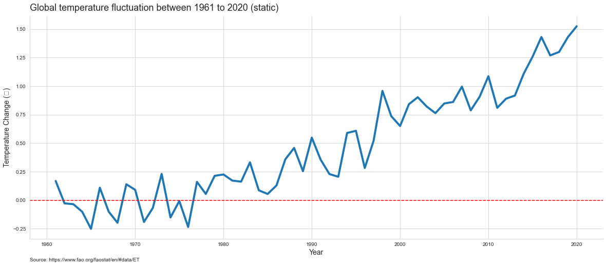
    


```python
#Construct visualisation 
plt.figure(figsize=(20,8))
fig = sns.barplot(x ="Year", y = "Value", data = Global, palette = "Blues")

#Customisation
plt.axvline(16, ls = "--", color = "grey", lw= 3)
fig.tick_params(axis='x', rotation=90)
plt.title("Global temperature fluctuation between 1961 to 2020 (static)", fontsize = 18, loc='left',   y = 1.01)

plt.annotate('Source: https://www.fao.org/faostat/en/#data/ET \nGlobal average temperature change, highlighting the temperature increases from 1977. ', (0,-.15), xycoords ='axes fraction' )

sns.despine(top = True, right = True, left = False, bottom = False)

```


    
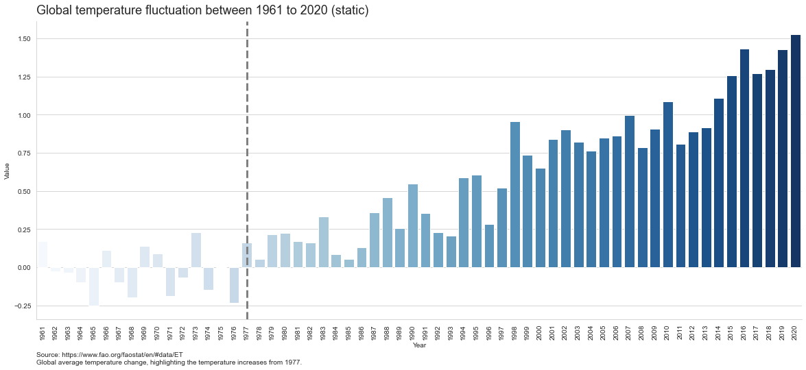
    


```python
#Construct visualisation 
plt.figure(figsize=(20,3))
sns.boxplot( x = "Value", data =Global, color = "seagreen")

#Customisation
plt.title("Distribution of the global temperature fluctuations", fontsize = 18,loc='left',  y = 1.01)
plt.title("Distribution of the global temperature fluctuations", fontsize = 18,loc='left')
plt.annotate('Source: https://www.fao.org/faostat/en/#data/ET', (0,-.3), xycoords ='axes fraction' )

sns.despine(top = True, right = True, left = True, bottom = False)

```


    
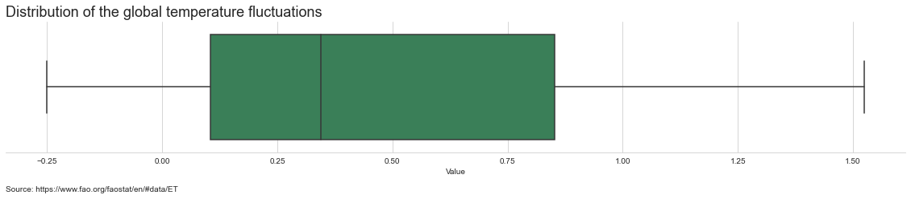
    


```python
#Restructure data for visualisation
df_group["Country"].replace("United Kingdom of Great Britain and Northern Ireland", "UK", inplace= True)
df_group["Country"].replace("United States of America", "USA", inplace= True)

g7_countries = ( "UK", "USA", "Canada", "Japan", "Germany", "France", "Italy")

g7 = df_group[df_group['Country'].isin(g7_countries)]
G7Overview = g7.groupby("Year")["Value"].mean().reset_index()
```


```python
#Construct visualisation 
plt.figure(figsize=(20,8))
sns.lineplot( x="Year", y= "Value", data = G7Overview, lw = 3)

#Customisation
plt.axhline(0, ls = "--", color = "red")

plt.title("Temperature fluctuations for the G7 nations between 1961 to 2020 (static)", fontsize = 18, loc='left', y = 1.01)

plt.xlabel("Year", fontsize=14)
plt.ylabel("Temperature Change (℃)", fontsize=14)
sns.despine(top = True, right = True, left = False, bottom = False)
plt.annotate('Source: https://www.fao.org/faostat/en/#data/ET', (0,-.1), xycoords ='axes fraction' )

plt.show()
```

    c:\Users\bhavya\anaconda39\lib\site-packages\matplotlib\backends\backend_agg.py:240: RuntimeWarning: Glyph 8451 missing from current font.
      font.set_text(s, 0.0, flags=flags)
    c:\Users\bhavya\anaconda39\lib\site-packages\matplotlib\backends\backend_agg.py:203: RuntimeWarning: Glyph 8451 missing from current font.
      font.set_text(s, 0, flags=flags)
    


    
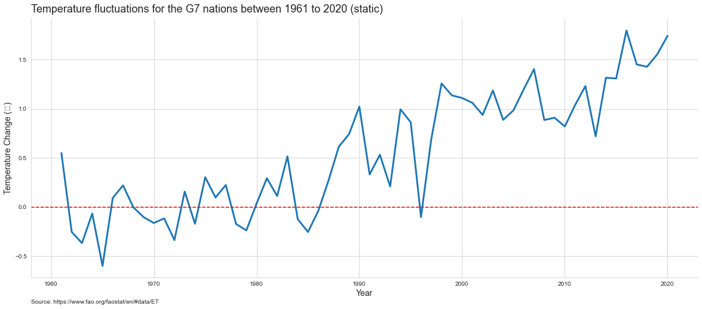
    


```python
#Restructure data for visualisation

BRICS_countries= ( "Brazil", "Russia", "India", "China", "South Africa")

BRICS = df_group[df_group['Country'].isin(BRICS_countries)]
BRICS_Overview = g7.groupby("Year")["Value"].mean().reset_index()
```


```python
#Construct visualisation 
plt.figure(figsize=(20,8))
sns.lineplot( x="Year", y= "Value", data = G7Overview, lw = 3)

#Customisation
plt.axhline(0, ls = "--", color = "red")

plt.title("Temperature fluctuations for the BRICS nation between 1961 to 2020 (static)", fontsize = 18, loc='left', y = 1.01)

plt.xlabel("Year", fontsize=14)
plt.ylabel("Temperature Change (℃)", fontsize=14)
sns.despine(top = True, right = True, left = False, bottom = False)
plt.annotate('Source: https://www.fao.org/faostat/en/#data/ET', (0,-.1), xycoords ='axes fraction' )

plt.show()
```

    c:\Users\bhavya\anaconda39\lib\site-packages\matplotlib\backends\backend_agg.py:240: RuntimeWarning: Glyph 8451 missing from current font.
      font.set_text(s, 0.0, flags=flags)
    c:\Users\bhavya\anaconda39\lib\site-packages\matplotlib\backends\backend_agg.py:203: RuntimeWarning: Glyph 8451 missing from current font.
      font.set_text(s, 0, flags=flags)
    


    

    


```python
#Restructure data for visualisation
data = BRICS[BRICS["Country"].isin(("India", "China"))]

#Construct visualisation 
plt.figure(figsize=(20,8))
sns.lineplot(data = data, x="Year", y = "Value", hue = "Country", lw=3, palette = "Paired")


#Customisation
plt.title("Temperature fluctuation for India and China between 1961 to 2020", fontsize = 18, loc='left', y = 1.01)
plt.axhline(0, ls = "--", color = "red")
plt.legend(title = "Country", bbox_to_anchor=(1.01, 1), loc='upper left', borderaxespad=0)

plt.xlabel("Year", fontsize=14)
plt.ylabel("Temperature Change (℃)", fontsize=14)
plt.annotate('Source: https://www.fao.org/faostat/en/#data/ET', (0,-.1), xycoords ='axes fraction' )
plt.legend(loc="upper center", ncol = len(data["Country"]) )

sns.despine(top = True, right = True, left = False, bottom = False)
```

    c:\Users\bhavya\anaconda39\lib\site-packages\matplotlib\backends\backend_agg.py:240: RuntimeWarning: Glyph 8451 missing from current font.
      font.set_text(s, 0.0, flags=flags)
    c:\Users\bhavya\anaconda39\lib\site-packages\matplotlib\backends\backend_agg.py:203: RuntimeWarning: Glyph 8451 missing from current font.
      font.set_text(s, 0, flags=flags)
    


    
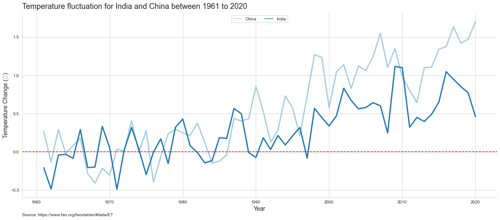
    


```python
#Restructure data for visualisation
data = df[df["Country"].isin(("India", "Bangladesh", "Pakistan"))]

#Construct visualisation 
plt.figure(figsize=(20,8))
sns.lineplot(data = data, x="Year", y = "Value", hue = "Country", lw=3, palette = "Paired")


#Customisation
plt.title("Temperature fluctuation for India , Bangladesh and Pakistan between 1961 to 2020", fontsize = 18, loc='left', y = 1.01)
plt.axhline(0, ls = "--", color = "red")
plt.legend(title = "Country", bbox_to_anchor=(1.01, 1), loc='upper left', borderaxespad=0)

plt.xlabel("Year", fontsize=14)
plt.ylabel("Temperature Change (℃)", fontsize=14)
plt.annotate('Source: https://www.fao.org/faostat/en/#data/ET', (0,-.1), xycoords ='axes fraction' )
plt.legend(loc="upper center", ncol = len(data["Country"]) )

sns.despine(top = True, right = True, left = False, bottom = False)
```

    c:\Users\bhavya\anaconda39\lib\site-packages\matplotlib\backends\backend_agg.py:240: RuntimeWarning: Glyph 8451 missing from current font.
      font.set_text(s, 0.0, flags=flags)
    c:\Users\bhavya\anaconda39\lib\site-packages\matplotlib\backends\backend_agg.py:203: RuntimeWarning: Glyph 8451 missing from current font.
      font.set_text(s, 0, flags=flags)
    


    
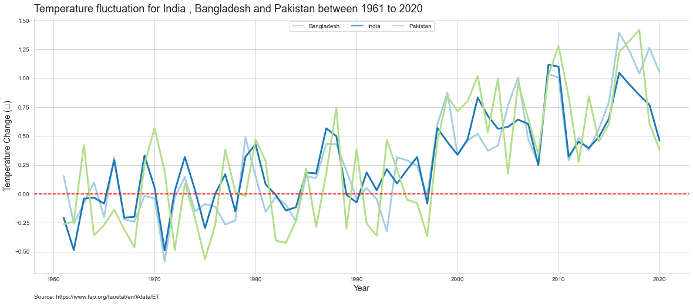
    


```python
#Restructure data for visualisation
g7_pivot = pd.pivot_table(g7, index = ["Country"], columns=["Year"], values = ["Value"])
g7_pivot["Total variation"] = g7_pivot.mean(axis=1)
g7_pivot.reset_index(inplace = True)

#Construct visualisation 
plt.figure(figsize= (20,8))
sns.barplot(y = "Country", x = "Total variation", data =g7_pivot, palette = "PuBuGn_r", order = g7_pivot.sort_values("Total variation", ascending = False)["Country"])

#Customisation
plt.title("Average total temperature variation for G7 nations between 1961 to 2020", fontsize = 18, loc='left', y = 1.01)


plt.ylabel("Country", fontsize=14)
plt.xlabel("Temperature Change (℃)", fontsize=14)
plt.annotate('Source: https://www.fao.org/faostat/en/#data/ET', (0,-.1), xycoords ='axes fraction' )
sns.despine(top = True, right = True, left = False, bottom = False)
```

    c:\Users\bhavya\anaconda39\lib\site-packages\matplotlib\backends\backend_agg.py:240: RuntimeWarning: Glyph 8451 missing from current font.
      font.set_text(s, 0.0, flags=flags)
    c:\Users\bhavya\anaconda39\lib\site-packages\matplotlib\backends\backend_agg.py:203: RuntimeWarning: Glyph 8451 missing from current font.
      font.set_text(s, 0, flags=flags)
    


    
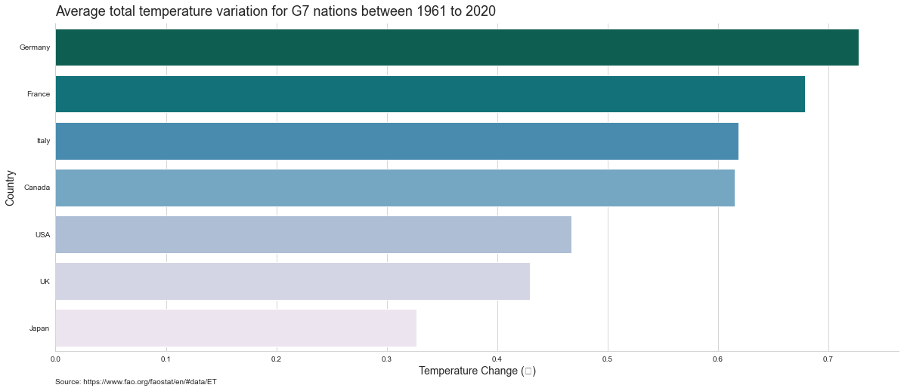
    


```python
#Restructure data for visualisation
BRICS_pivot = pd.pivot_table(BRICS, index = ["Country"], columns=["Year"], values = ["Value"])
BRICS_pivot["Total variation"] = BRICS_pivot.mean(axis=1)
BRICS_pivot.reset_index(inplace = True)

#Construct visualisation 
plt.figure(figsize= (20,8))
sns.barplot(y = "Country", x = "Total variation", data =BRICS_pivot, palette = "PuBuGn_r", order = BRICS_pivot.sort_values("Total variation", ascending = False)["Country"])

#Customisation
plt.title("Average total temperature variation for BRICS nations between 1961 to 2020", fontsize = 18, loc='left', y = 1.01)


plt.ylabel("Country", fontsize=14)
plt.xlabel("Temperature Change (℃)", fontsize=14)
plt.annotate('Source: https://www.fao.org/faostat/en/#data/ET', (0,-.1), xycoords ='axes fraction' )
sns.despine(top = True, right = True, left = False, bottom = False)
```

    c:\Users\bhavya\anaconda39\lib\site-packages\matplotlib\backends\backend_agg.py:240: RuntimeWarning: Glyph 8451 missing from current font.
      font.set_text(s, 0.0, flags=flags)
    c:\Users\bhavya\anaconda39\lib\site-packages\matplotlib\backends\backend_agg.py:203: RuntimeWarning: Glyph 8451 missing from current font.
      font.set_text(s, 0, flags=flags)
    


    
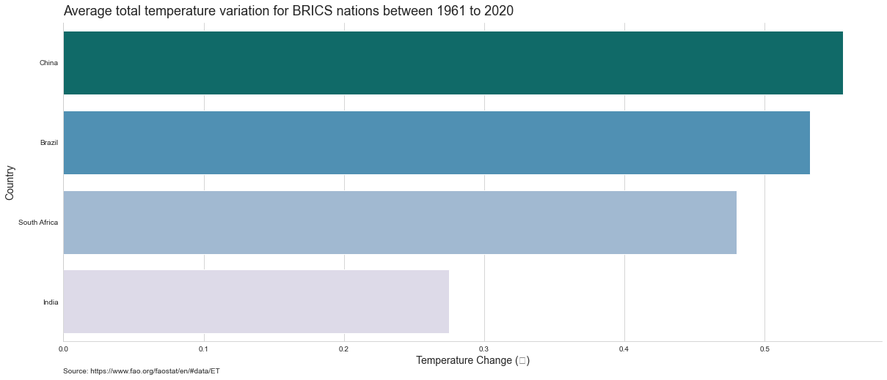
    


```python
#Restructure data for visualisation
IPB = df[df["Country"].isin(("India", "Bangladesh", "Pakistan"))]
```


```python
#Restructure data for visualisation
IPB_pivot = pd.pivot_table(IPB, index = ["Country"], columns=["Year"], values = ["Value"])
IPB_pivot["Total variation"] = IPB_pivot.mean(axis=1)
IPB_pivot.reset_index(inplace = True)

#Construct visualisation 
plt.figure(figsize= (20,8))
sns.barplot(y = "Country", x = "Total variation", data =IPB_pivot, palette = "PuBuGn_r", order = IPB_pivot.sort_values("Total variation", ascending = False)["Country"])

#Customisation
plt.title("Average total temperature variation for India, Bangladesh and Pakistan between 1961 to 2020", fontsize = 18, loc='left', y = 1.01)


plt.ylabel("Country", fontsize=14)
plt.xlabel("Temperature Change (℃)", fontsize=14)
plt.annotate('Source: https://www.fao.org/faostat/en/#data/ET', (0,-.1), xycoords ='axes fraction' )
sns.despine(top = True, right = True, left = False, bottom = False)
```

    c:\Users\bhavya\anaconda39\lib\site-packages\matplotlib\backends\backend_agg.py:240: RuntimeWarning: Glyph 8451 missing from current font.
      font.set_text(s, 0.0, flags=flags)
    c:\Users\bhavya\anaconda39\lib\site-packages\matplotlib\backends\backend_agg.py:203: RuntimeWarning: Glyph 8451 missing from current font.
      font.set_text(s, 0, flags=flags)
    


    
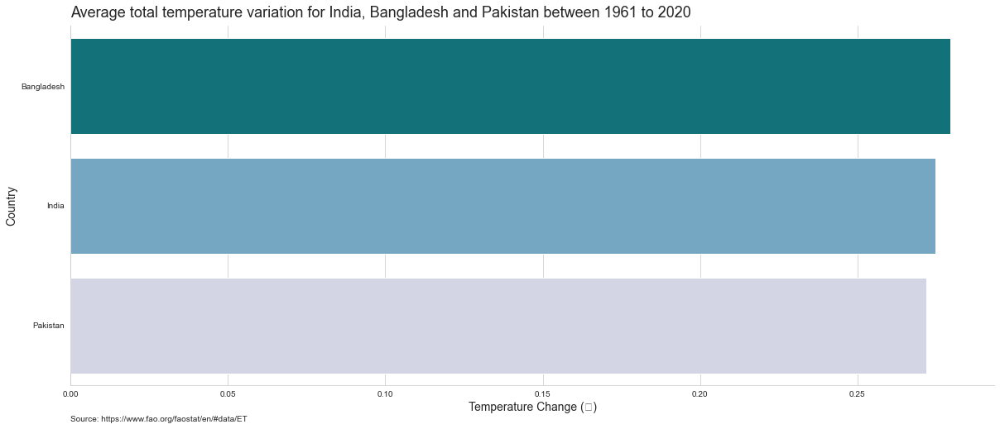
    


```python
South_Asia = ["Afghanistan", "Bangladesh", "Bhutan", "India", "Maldives", "Nepal", "Pakistan", "Sri Lanka"]
```


```python
#Construct visualisation 
plt.figure(figsize = (20,8))
sns.lineplot(x = "Year", y = "Value", data = SA, markers = "o", lw = 3)

#Customisation
plt.axhline(0, ls = "--", color = "red")

plt.title("Temperature fluctuation for South Asian countries between 1961 to 2020 (static)", fontsize = 18, loc='left', y = 1.01)

plt.xlabel("Year", fontsize=14)
plt.ylabel("Temperature Change (℃)", fontsize=14)
plt.annotate('Source: https://www.fao.org/faostat/en/#data/ET', (0,-.1), xycoords ='axes fraction' )
sns.despine(top = True, right = True, left = False, bottom = False)
```

    c:\Users\bhavya\anaconda39\lib\site-packages\matplotlib\backends\backend_agg.py:240: RuntimeWarning: Glyph 8451 missing from current font.
      font.set_text(s, 0.0, flags=flags)
    c:\Users\bhavya\anaconda39\lib\site-packages\matplotlib\backends\backend_agg.py:203: RuntimeWarning: Glyph 8451 missing from current font.
      font.set_text(s, 0, flags=flags)
    


    
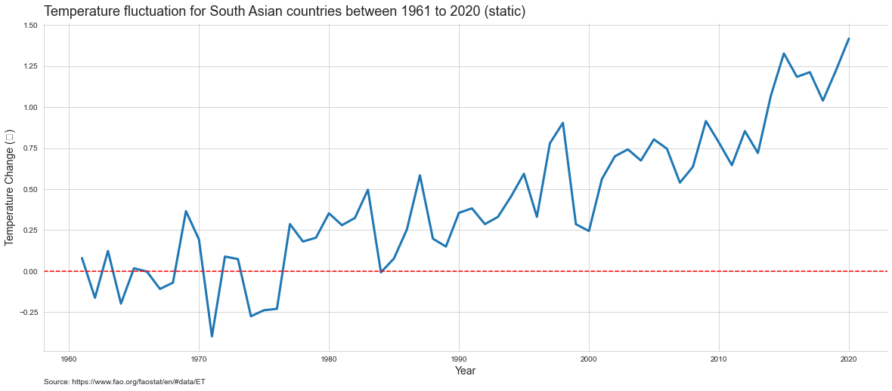
    


```python
South_America = ["Argentina","Bolivia","Brazil","Chile","Colombia","Ecuador","French Guyana",
                 "Guyana","Paraguay","Peru","Suriname","Uruguay","Venezuela"]
# https://www.britannica.com/topic/list-of-countries-in-Latin-America-2061416
```


```python
#Construct visualisation 
plt.figure(figsize = (20,8))
sns.lineplot(x = "Year", y = "Value", data = SA, markers = "o", lw = 3)

#Customisation
plt.axhline(0, ls = "--", color = "red")

plt.title("Temperature fluctuation for South American between 1961 to 2020 (static)", fontsize = 18, loc='left', y = 1.01)

plt.xlabel("Year", fontsize=14)
plt.ylabel("Temperature Change (℃)", fontsize=14)
plt.annotate('Source: https://www.fao.org/faostat/en/#data/ET', (0,-.1), xycoords ='axes fraction' )
sns.despine(top = True, right = True, left = False, bottom = False)
```

    c:\Users\bhavya\anaconda39\lib\site-packages\matplotlib\backends\backend_agg.py:240: RuntimeWarning: Glyph 8451 missing from current font.
      font.set_text(s, 0.0, flags=flags)
    c:\Users\bhavya\anaconda39\lib\site-packages\matplotlib\backends\backend_agg.py:203: RuntimeWarning: Glyph 8451 missing from current font.
      font.set_text(s, 0, flags=flags)
    


    
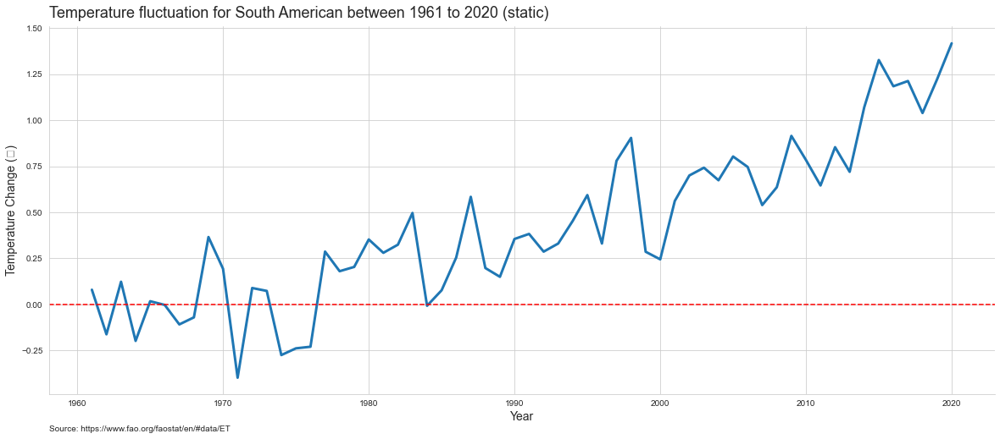
    


```python
#Restructure data for visualisation
South_America_pivot = pd.pivot_table(South_America, index = ["Country"], columns=["Year"], values = ["Value"])
South_America_pivot["Total variation"] = South_America_pivot.mean(axis=1)
South_America_pivot.reset_index(inplace = True)

#Construct visualisation 
plt.figure(figsize= (20,8))
sns.barplot(y = "Country", x = "Total variation", data =South_America_pivot, 
            palette = "PuBuGn_r", order = South_America_pivot.sort_values("Total variation", ascending = False)["Country"])

#Customisation
plt.ylabel("Country", fontsize=14)
plt.xlabel("Temperature Change (℃)", fontsize=14)

plt.title("Average total temperature fluctuation for South American countries between 1961 to 2020", 
          fontsize = 18, loc='left', y = 1.01)
plt.annotate('Source: https://www.fao.org/faostat/en/#data/ET', (0,-.1), xycoords ='axes fraction' )
sns.despine(top = True, right = True, left = False, bottom = False)
```

    c:\Users\bhavya\anaconda39\lib\site-packages\matplotlib\backends\backend_agg.py:240: RuntimeWarning: Glyph 8451 missing from current font.
      font.set_text(s, 0.0, flags=flags)
    c:\Users\bhavya\anaconda39\lib\site-packages\matplotlib\backends\backend_agg.py:203: RuntimeWarning: Glyph 8451 missing from current font.
      font.set_text(s, 0, flags=flags)
    


    
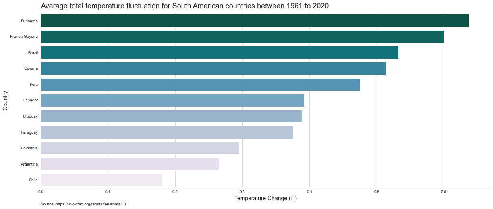
    


```python
#Construct visualisation 
plt.figure(figsize= (20,6))
sns.boxplot(x = "Country", y = "Value", data = South_America, palette = "PuBuGn_r", 
            order = South_America_pivot.sort_values("Total variation", ascending = True)["Country"])

#Customisation
plt.axhline(0, ls = "--", color = "red")
plt.xlabel("Country", fontsize=14)
plt.ylabel("Temperature Change (℃)", fontsize=14)

plt.title("Box plot distribution of the temperature fluctuations for South American nations", fontsize = 18, loc='left', y = 1.01)
plt.annotate('Source: https://www.fao.org/faostat/en/#data/ET', (0,-.1), xycoords ='axes fraction' )

sns.despine(top = True, right = True, left = False, bottom = False)
```

    c:\Users\bhavya\anaconda39\lib\site-packages\matplotlib\backends\backend_agg.py:240: RuntimeWarning: Glyph 8451 missing from current font.
      font.set_text(s, 0.0, flags=flags)
    c:\Users\bhavya\anaconda39\lib\site-packages\matplotlib\backends\backend_agg.py:203: RuntimeWarning: Glyph 8451 missing from current font.
      font.set_text(s, 0, flags=flags)
    


    
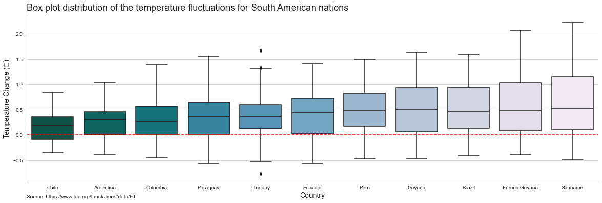
    


```python
df_pivot = pd.pivot_table(df_group, index = ["Country"], columns=["Year"], values = ["Value"])
df_pivot["Total variation"] = df_pivot.mean(axis=1)
df_pivot.reset_index(inplace = True)


data = dict(
        type = 'choropleth',
        colorscale = 'temps',
        reversescale = False,
        locations = df_pivot["Country"],
        locationmode = "country names",
        z = df_pivot['Total variation'],
        text = df_pivot["Country"],
        colorbar = {'title' : 'Total variation'},
      ) 

layout = dict(title = 'Choromap of average temperature for countries between 1961 to 2020', geo = dict(showframe = False, projection = {'type':'mercator'})
             )
```

# Understanding the dataset


```python
data = pd.read_csv("C:\\Users\\bhavya\\Documents\\codanics\\challenge-1\\temperature_change_data.csv")
data.columns
```


    Index(['Domain Code', 'Domain', 'Area Code (ISO3)', 'Area', 'Element Code',
           'Element', 'Months Code', 'Months', 'Year Code', 'Year', 'Unit',
           'Value', 'Flag', 'Flag Description'],
          dtype='object')


```python
data.info()
```

    <class 'pandas.core.frame.DataFrame'>
    RangeIndex: 67625 entries, 0 to 67624
    Data columns (total 14 columns):
     #   Column            Non-Null Count  Dtype  
    ---  ------            --------------  -----  
     0   Domain Code       67625 non-null  object 
     1   Domain            67625 non-null  object 
     2   Area Code (ISO3)  67625 non-null  object 
     3   Area              67625 non-null  object 
     4   Element Code      67625 non-null  int64  
     5   Element           67625 non-null  object 
     6   Months Code       67625 non-null  int64  
     7   Months            67625 non-null  object 
     8   Year Code         67625 non-null  int64  
     9   Year              67625 non-null  int64  
     10  Unit              67625 non-null  object 
     11  Value             65331 non-null  float64
     12  Flag              67625 non-null  object 
     13  Flag Description  67625 non-null  object 
    dtypes: float64(1), int64(4), object(9)
    memory usage: 7.2+ MB
    


```python
data[data["Value"].isnull()].head()
```


<div>
<style scoped>
    .dataframe tbody tr th:only-of-type {
        vertical-align: middle;
    }

    .dataframe tbody tr th {
        vertical-align: top;
    }

    .dataframe thead th {
        text-align: right;
    }
</style>
<table border="1" class="dataframe">
  <thead>
    <tr style="text-align: right;">
      <th></th>
      <th>Domain Code</th>
      <th>Domain</th>
      <th>Area Code (ISO3)</th>
      <th>Area</th>
      <th>Element Code</th>
      <th>Element</th>
      <th>Months Code</th>
      <th>Months</th>
      <th>Year Code</th>
      <th>Year</th>
      <th>Unit</th>
      <th>Value</th>
      <th>Flag</th>
      <th>Flag Description</th>
    </tr>
  </thead>
  <tbody>
    <tr>
      <th>937</th>
      <td>ET</td>
      <td>Temperature change</td>
      <td>ASM</td>
      <td>American Samoa</td>
      <td>7271</td>
      <td>Temperature change</td>
      <td>7016</td>
      <td>Dec–Jan–Feb</td>
      <td>1998</td>
      <td>1998</td>
      <td>°C</td>
      <td>NaN</td>
      <td>NV</td>
      <td>Data not available</td>
    </tr>
    <tr>
      <th>949</th>
      <td>ET</td>
      <td>Temperature change</td>
      <td>ASM</td>
      <td>American Samoa</td>
      <td>7271</td>
      <td>Temperature change</td>
      <td>7016</td>
      <td>Dec–Jan–Feb</td>
      <td>2010</td>
      <td>2010</td>
      <td>°C</td>
      <td>NaN</td>
      <td>NV</td>
      <td>Data not available</td>
    </tr>
    <tr>
      <th>996</th>
      <td>ET</td>
      <td>Temperature change</td>
      <td>ASM</td>
      <td>American Samoa</td>
      <td>7271</td>
      <td>Temperature change</td>
      <td>7017</td>
      <td>Mar–Apr–May</td>
      <td>1997</td>
      <td>1997</td>
      <td>°C</td>
      <td>NaN</td>
      <td>NV</td>
      <td>Data not available</td>
    </tr>
    <tr>
      <th>997</th>
      <td>ET</td>
      <td>Temperature change</td>
      <td>ASM</td>
      <td>American Samoa</td>
      <td>7271</td>
      <td>Temperature change</td>
      <td>7017</td>
      <td>Mar–Apr–May</td>
      <td>1998</td>
      <td>1998</td>
      <td>°C</td>
      <td>NaN</td>
      <td>NV</td>
      <td>Data not available</td>
    </tr>
    <tr>
      <th>1056</th>
      <td>ET</td>
      <td>Temperature change</td>
      <td>ASM</td>
      <td>American Samoa</td>
      <td>7271</td>
      <td>Temperature change</td>
      <td>7018</td>
      <td>Jun–Jul–Aug</td>
      <td>1997</td>
      <td>1997</td>
      <td>°C</td>
      <td>NaN</td>
      <td>NV</td>
      <td>Data not available</td>
    </tr>
  </tbody>
</table>
</div>


```python
x = ((data["Value"].isnull().sum()/len(data))*100).round(1)

print ("Approx", x, "% of data in the Value variable are null values.")
```

    Approx 3.4 % of data in the Value variable are null values.
    


```python
data.drop(data[data["Value"].isnull()].index, axis = 0, inplace = True)
```


```python
data["Months"].value_counts()
```


    Dec–Jan–Feb            13080
    Mar–Apr–May            13077
    Jun–Jul–Aug            13069
    Sep–Oct–Nov            13061
    Meteorological year    13044
    Name: Months, dtype: int64


```python
data = data[data["Months"]=="Meteorological year"]
```


```python
df_group = data.groupby(["Area", "Year"])["Value"].mean().reset_index()

print ("Oldest entry - ", df_group["Year"].min())
```

    Oldest entry -  1961
    


```python
print ("Newest entry - ", df_group["Year"].max())
```

    Newest entry -  2020
    


```python
x = df_group["Year"].to_numpy()
print ( "The dataset contains records for", np.ptp(x), "years, starting from", df_group["Year"].min(), "to", df_group["Year"].max())
```

    The dataset contains records for 59 years, starting from 1961 to 2020
    


```python
x = (df_group["Year"].max() +1) - df_group["Year"].min() == df_group["Year"].nunique()

print( "Are there Values for for every year between 1961 and 2020?", x)
```

    Are there Values for for every year between 1961 and 2020? True
    


```python
data["Area"].unique()
```


    array(['Afghanistan', 'Albania', 'Algeria', 'American Samoa', 'Andorra',
           'Angola', 'Anguilla', 'Antarctica', 'Antigua and Barbuda',
           'Argentina', 'Armenia', 'Aruba', 'Australia', 'Austria',
           'Azerbaijan', 'Bahamas', 'Bahrain', 'Bangladesh', 'Barbados',
           'Belarus', 'Belgium', 'Belgium-Luxembourg', 'Belize', 'Benin',
           'Bhutan', 'Bolivia (Plurinational State of)',
           'Bosnia and Herzegovina', 'Botswana', 'Brazil',
           'British Virgin Islands', 'Brunei Darussalam', 'Bulgaria',
           'Burkina Faso', 'Burundi', 'Cabo Verde', 'Cambodia', 'Cameroon',
           'Canada', 'Cayman Islands', 'Central African Republic', 'Chad',
           'Channel Islands', 'Chile', 'China', 'China, Hong Kong SAR',
           'China, Macao SAR', 'China, mainland', 'China, Taiwan Province of',
           'Christmas Island', 'Cocos (Keeling) Islands', 'Colombia',
           'Comoros', 'Congo', 'Cook Islands', 'Costa Rica', "Côte d'Ivoire",
           'Croatia', 'Cuba', 'Cyprus', 'Czechia', 'Czechoslovakia',
           "Democratic People's Republic of Korea",
           'Democratic Republic of the Congo', 'Denmark', 'Djibouti',
           'Dominica', 'Dominican Republic', 'Ecuador', 'Egypt',
           'El Salvador', 'Equatorial Guinea', 'Eritrea', 'Estonia',
           'Eswatini', 'Ethiopia', 'Ethiopia PDR',
           'Falkland Islands (Malvinas)', 'Faroe Islands', 'Fiji', 'Finland',
           'France', 'French Guyana', 'French Polynesia',
           'French Southern Territories', 'Gabon', 'Gambia', 'Georgia',
           'Germany', 'Ghana', 'Gibraltar', 'Greece', 'Greenland', 'Grenada',
           'Guadeloupe', 'Guatemala', 'Guinea', 'Guinea-Bissau', 'Guyana',
           'Haiti', 'Holy See', 'Honduras', 'Hungary', 'Iceland', 'India',
           'Indonesia', 'Iran (Islamic Republic of)', 'Iraq', 'Ireland',
           'Isle of Man', 'Israel', 'Italy', 'Jamaica', 'Japan', 'Jordan',
           'Kazakhstan', 'Kenya', 'Kiribati', 'Kuwait', 'Kyrgyzstan',
           "Lao People's Democratic Republic", 'Latvia', 'Lebanon', 'Lesotho',
           'Liberia', 'Libya', 'Liechtenstein', 'Lithuania', 'Luxembourg',
           'Madagascar', 'Malawi', 'Malaysia', 'Maldives', 'Mali', 'Malta',
           'Marshall Islands', 'Martinique', 'Mauritania', 'Mauritius',
           'Mayotte', 'Mexico', 'Micronesia (Federated States of)',
           'Midway Island', 'Monaco', 'Mongolia', 'Montenegro', 'Montserrat',
           'Morocco', 'Mozambique', 'Myanmar', 'Namibia', 'Nauru', 'Nepal',
           'Netherlands', 'Netherlands Antilles (former)', 'New Caledonia',
           'New Zealand', 'Nicaragua', 'Niger', 'Nigeria', 'Niue',
           'Norfolk Island', 'North Macedonia', 'Norway', 'Oman',
           'Pacific Islands Trust Territory', 'Pakistan', 'Palau',
           'Palestine', 'Panama', 'Papua New Guinea', 'Paraguay', 'Peru',
           'Philippines', 'Pitcairn', 'Poland', 'Portugal', 'Puerto Rico',
           'Qatar', 'Republic of Korea', 'Republic of Moldova', 'Réunion',
           'Romania', 'Russian Federation', 'Rwanda',
           'Saint Helena, Ascension and Tristan da Cunha',
           'Saint Kitts and Nevis', 'Saint Lucia',
           'Saint Pierre and Miquelon', 'Saint Vincent and the Grenadines',
           'Samoa', 'San Marino', 'Sao Tome and Principe', 'Saudi Arabia',
           'Senegal', 'Serbia', 'Serbia and Montenegro', 'Seychelles',
           'Sierra Leone', 'Singapore', 'Slovakia', 'Slovenia',
           'Solomon Islands', 'Somalia', 'South Africa',
           'South Georgia and the South Sandwich Islands', 'South Sudan',
           'Spain', 'Sri Lanka', 'Sudan', 'Sudan (former)', 'Suriname',
           'Svalbard and Jan Mayen Islands', 'Sweden', 'Switzerland',
           'Syrian Arab Republic', 'Tajikistan', 'Thailand', 'Timor-Leste',
           'Togo', 'Tokelau', 'Tonga', 'Trinidad and Tobago', 'Tunisia',
           'Turkey', 'Turkmenistan', 'Turks and Caicos Islands', 'Tuvalu',
           'Uganda', 'Ukraine', 'United Arab Emirates',
           'United Kingdom of Great Britain and Northern Ireland',
           'United Republic of Tanzania', 'United States of America',
           'United States Virgin Islands', 'Uruguay', 'USSR', 'Uzbekistan',
           'Vanuatu', 'Venezuela (Bolivarian Republic of)', 'Viet Nam',
           'Wake Island', 'Wallis and Futuna Islands', 'Western Sahara',
           'Yemen', 'Yugoslav SFR', 'Zambia', 'Zimbabwe'], dtype=object)


```python
data.rename(columns = {"Area": "Country"}, inplace = True)
```


```python
x = data[data["Country"]== "USSR"]["Year"].max()
print ("Most recent record for USSR is", x)
```

    Most recent record for USSR is 1991
    


```python
data["Country"].value_counts()
```


    Afghanistan              60
    Mali                     60
    Martinique               60
    Mauritania               60
    Mauritius                60
                             ..
    Montenegro               15
    Serbia                   15
    Serbia and Montenegro    14
    Sudan                    10
    South Sudan              10
    Name: Country, Length: 247, dtype: int64


```python
#Restructure data for visualisation
limited_values = data["Area Code (ISO3)"].value_counts().tail().rename_axis('Country').reset_index(name='counts')
limited_values = data[data['Area Code (ISO3)'].isin(limited_values["Country"])]

#Construct visualisation 
plt.figure(figsize =(20,10))
sns.lineplot(data = limited_values, x="Year", y = "Value", hue = "Country", palette = "crest",style = "Country", lw= 3)

#Customisation
plt.title("Temperature fluctuations for nations with limited data", fontsize = 18, loc='left', y = 1.01)
plt.xlabel("Year", fontsize=14)
plt.ylabel("Temperature Change (℃)", fontsize=14)

plt.axhline(0, ls = "--", color = "red")
plt.annotate('Source: https://www.fao.org/faostat/en/#data/ET', (0,-.1), xycoords ='axes fraction' )
sns.despine(top = True, right = True, left = False, bottom = False)

```

    c:\Users\bhavya\anaconda39\lib\site-packages\matplotlib\backends\backend_agg.py:240: RuntimeWarning: Glyph 8451 missing from current font.
      font.set_text(s, 0.0, flags=flags)
    c:\Users\bhavya\anaconda39\lib\site-packages\matplotlib\backends\backend_agg.py:203: RuntimeWarning: Glyph 8451 missing from current font.
      font.set_text(s, 0, flags=flags)
    


    
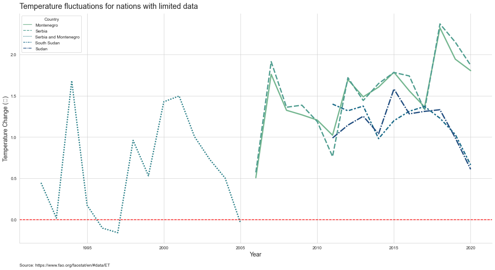
    


```python
data["Value"].describe()
```


    count    13044.000000
    mean         0.491651
    std          0.649765
    min         -3.251000
    25%          0.032000
    50%          0.415500
    75%          0.882000
    max          5.328000
    Name: Value, dtype: float64


```python
#Construct visualisation 
plt.figure(figsize = (20,6)) 
fig = sns.histplot(x = "Value", data = data, kde= True, bins = 50,)

#Customisation
plt.title("Frequency distribution of yearly temperature changes", fontsize = 18, loc='left', y = 1.01)
plt.axvline(0, ls = "--", color = "red", lw= 3)

plt.xlabel("Temperature Change (℃)", fontsize=14)
plt.ylabel("Frequency", fontsize=14)
sns.despine(top = True, right = True, left = False, bottom = False)
```

    c:\Users\bhavya\anaconda39\lib\site-packages\matplotlib\backends\backend_agg.py:240: RuntimeWarning: Glyph 8451 missing from current font.
      font.set_text(s, 0.0, flags=flags)
    c:\Users\bhavya\anaconda39\lib\site-packages\matplotlib\backends\backend_agg.py:203: RuntimeWarning: Glyph 8451 missing from current font.
      font.set_text(s, 0, flags=flags)
    


    
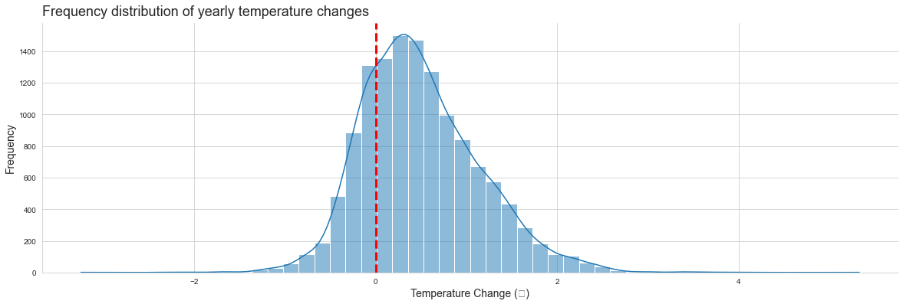
    


```python
#Construct visualisation 
plt.figure(figsize = (20,6)) 
sns.boxplot(x = "Value", data = data, color = "seagreen")

#Customisation
plt.title("Box plot Distribution of the yearly temperature changes", fontsize = 18, loc='left', y = 1.01)
sns.despine(top = True, right = True, left = True, bottom = False)
```


    
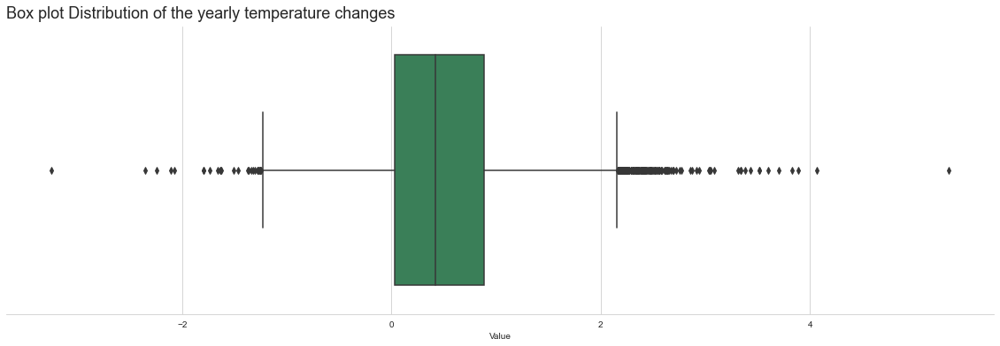
    


```python
#Construct visualisation 
plt.figure(figsize=(10,6))
sns.countplot(x = "Flag Description", data= data, palette = "Greens")

#Customisation
plt.title("Distribution data in Flag Description", fontsize = 18, loc='left', y = 1.01)

plt.show()
```


    
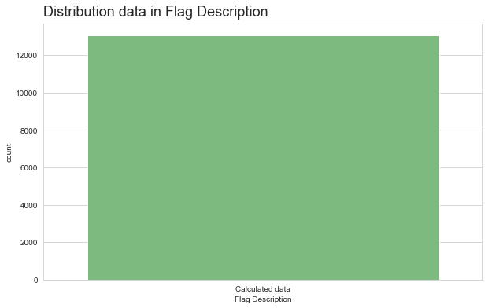
    


```python
data["Unit"].unique()
```


    array(['°C'], dtype=object)


```python
#Construct visualisation 
plt.figure(figsize = (20,10))
fig = sns.lineplot( x="Year", y = "Value", data = df_group, hue = "Country", palette = "Blues", lw =2) 

#Customisation
plt.title("Global temperature fluctuation of countries between 1961 to 2020", fontsize = 18, loc='left', y = 1.01)

plt.axhline(0, ls = "--", color = "red", lw =2)
plt.xlabel("Year", fontsize=14)
plt.ylabel("Temperature Change (℃)", fontsize=14)
fig.get_legend().remove()

plt.annotate('Source: https://www.fao.org/faostat/en/#data/ET', (0,-.1), xycoords ='axes fraction' )
sns.despine(top = True, right = True, left = False, bottom = False)
```

    c:\Users\bhavya\anaconda39\lib\site-packages\matplotlib\backends\backend_agg.py:240: RuntimeWarning: Glyph 8451 missing from current font.
      font.set_text(s, 0.0, flags=flags)
    c:\Users\bhavya\anaconda39\lib\site-packages\matplotlib\backends\backend_agg.py:203: RuntimeWarning: Glyph 8451 missing from current font.
      font.set_text(s, 0, flags=flags)
    


    
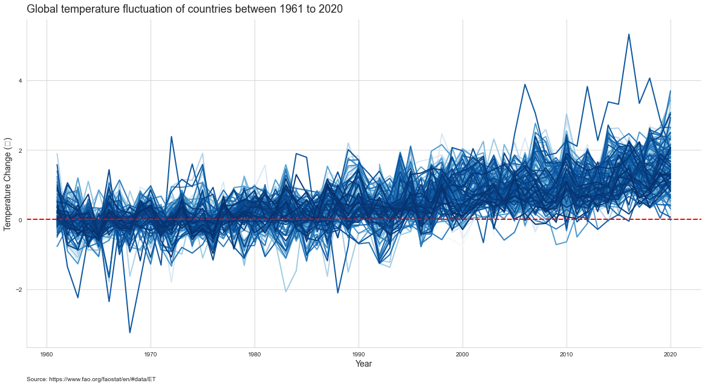
    


# Understanding data from INDIA , Bangladesh and Pakistan.


```python

df_sub = df[df["Country"].isin(["India", "Pakistan", 'Bangladesh'])]
df_sub.head()
```


<div>
<style scoped>
    .dataframe tbody tr th:only-of-type {
        vertical-align: middle;
    }

    .dataframe tbody tr th {
        vertical-align: top;
    }

    .dataframe thead th {
        text-align: right;
    }
</style>
<table border="1" class="dataframe">
  <thead>
    <tr style="text-align: right;">
      <th></th>
      <th>Domain Code</th>
      <th>Domain</th>
      <th>Area Code (ISO3)</th>
      <th>Country</th>
      <th>Element Code</th>
      <th>Element</th>
      <th>Months Code</th>
      <th>Months</th>
      <th>Year Code</th>
      <th>Year</th>
      <th>Unit</th>
      <th>Value</th>
      <th>Flag</th>
      <th>Flag Description</th>
    </tr>
  </thead>
  <tbody>
    <tr>
      <th>5030</th>
      <td>ET</td>
      <td>Temperature change</td>
      <td>BGD</td>
      <td>Bangladesh</td>
      <td>7271</td>
      <td>Temperature change</td>
      <td>7020</td>
      <td>Meteorological year</td>
      <td>1961</td>
      <td>1961</td>
      <td>°C</td>
      <td>0.155</td>
      <td>Fc</td>
      <td>Calculated data</td>
    </tr>
    <tr>
      <th>5031</th>
      <td>ET</td>
      <td>Temperature change</td>
      <td>BGD</td>
      <td>Bangladesh</td>
      <td>7271</td>
      <td>Temperature change</td>
      <td>7020</td>
      <td>Meteorological year</td>
      <td>1962</td>
      <td>1962</td>
      <td>°C</td>
      <td>-0.258</td>
      <td>Fc</td>
      <td>Calculated data</td>
    </tr>
    <tr>
      <th>5032</th>
      <td>ET</td>
      <td>Temperature change</td>
      <td>BGD</td>
      <td>Bangladesh</td>
      <td>7271</td>
      <td>Temperature change</td>
      <td>7020</td>
      <td>Meteorological year</td>
      <td>1963</td>
      <td>1963</td>
      <td>°C</td>
      <td>-0.082</td>
      <td>Fc</td>
      <td>Calculated data</td>
    </tr>
    <tr>
      <th>5033</th>
      <td>ET</td>
      <td>Temperature change</td>
      <td>BGD</td>
      <td>Bangladesh</td>
      <td>7271</td>
      <td>Temperature change</td>
      <td>7020</td>
      <td>Meteorological year</td>
      <td>1964</td>
      <td>1964</td>
      <td>°C</td>
      <td>0.099</td>
      <td>Fc</td>
      <td>Calculated data</td>
    </tr>
    <tr>
      <th>5034</th>
      <td>ET</td>
      <td>Temperature change</td>
      <td>BGD</td>
      <td>Bangladesh</td>
      <td>7271</td>
      <td>Temperature change</td>
      <td>7020</td>
      <td>Meteorological year</td>
      <td>1965</td>
      <td>1965</td>
      <td>°C</td>
      <td>-0.200</td>
      <td>Fc</td>
      <td>Calculated data</td>
    </tr>
  </tbody>
</table>
</div>


```python
df_sub[df_sub["Country"]=="Bangladesh"].groupby("Year")["Value"].mean().plot(kind="bar")
```


    <AxesSubplot:xlabel='Year'>


    
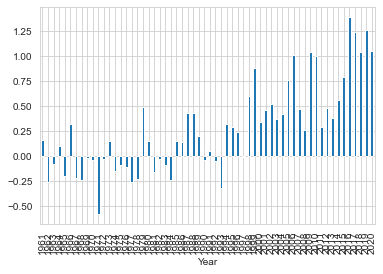
    


```python
df_sub[df_sub["Country"]=="India"].groupby("Year")["Value"].mean().plot(kind="bar")
```


    <AxesSubplot:xlabel='Year'>


    
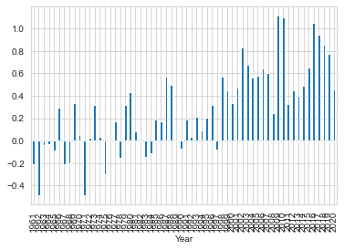
    


```python
df_sub[df_sub["Country"]=="Pakistan"].groupby("Year")["Value"].mean().plot(kind="bar")
```


    <AxesSubplot:xlabel='Year'>


    
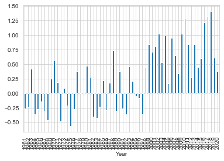
    


```python
df_sub.groupby(['Country','Year'])['Value'].mean(
).unstack().plot(kind='barh', figsize=(15, 10))
```


    <AxesSubplot:ylabel='Country'>


    
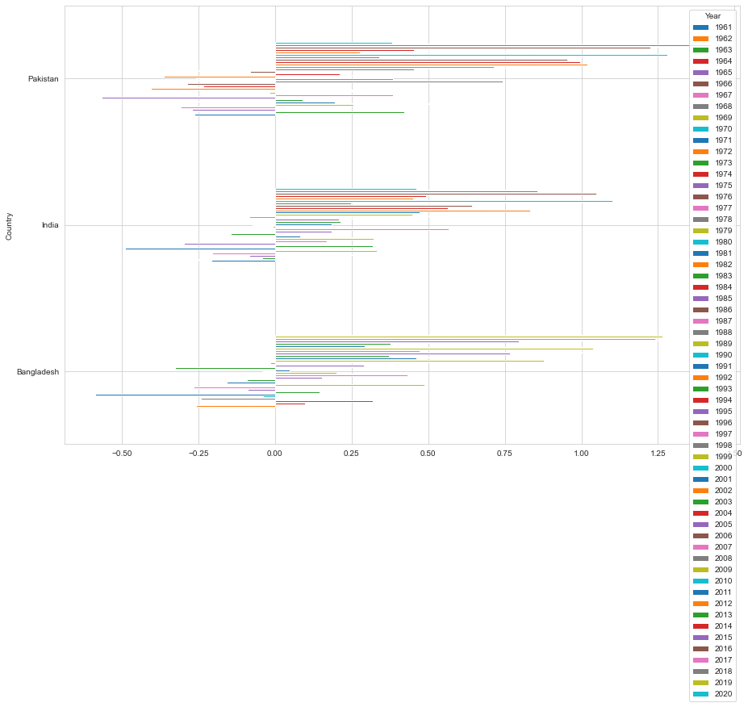
    

